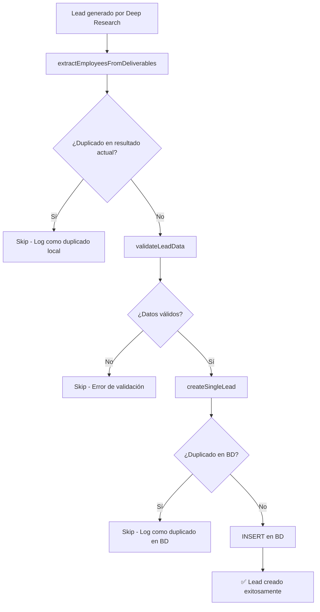

# Solución al Problema de Leads Duplicados

## 🚨 Problema Identificado

Aunque el workflow de `leadGenerationWorkflow` está excluyendo empresas duplicadas en el paso de `regionVenuesActivity`, **los leads individuales con el mismo nombre y correo electrónico se estaban creando de forma duplicada** en la base de datos.

### Causa del Problema

El flujo de validación tenía una brecha crítica:

1. ✅ **Exclusión de empresas duplicadas**: El workflow busca empresas existentes en la ciudad y las excluye del `regionVenuesActivity`
2. ✅ **Validación de duplicados dentro del workflow**: `extractEmployeesFromDeliverables` previene duplicados dentro del mismo resultado
3. ❌ **Sin validación de duplicados en la base de datos**: La función `createSingleLead` NO verificaba si ya existía un lead con el mismo nombre o correo

```typescript
// ANTES (problemático)
const { data, error } = await supabaseServiceRole
  .from('leads')
  .insert([leadData])  // ❌ INSERT directo sin validación
  .select()
  .single();
```

## ✅ Solución Implementada

### 1. Validación de Duplicados en `createSingleLead`

Agregamos validación antes del INSERT para verificar leads duplicados por:
- **Nombre** (siempre requerido)
- **Email** (si está disponible)

```typescript
// DESPUÉS (solucionado)
// ✅ STEP 1: Check for duplicate leads by name and email
console.log(`🔍 Checking for duplicate leads: name="${lead.name}", email="${lead.email || 'none'}"`);

if (lead.email) {
  // Use OR condition: same name OR same email (both for same site)
  const { data: duplicateLeads, error: duplicateError } = await supabaseServiceRole
    .from('leads')
    .select('id, name, email, phone')
    .eq('site_id', site_id)
    .or(`name.eq.${lead.name},email.eq.${lead.email}`);

  if (duplicateLeads && duplicateLeads.length > 0) {
    return {
      success: false,
      error: `Lead already exists with same ${duplicateReason}: ${duplicate.name}`
    };
  }
}
```

### 2. Manejo Inteligente de Errores de Duplicados

Modificamos `createLeadsFromResearchActivity` para distinguir entre:
- **Duplicados esperados** (no se cuentan como errores)
- **Errores reales** (problemas de base de datos)

```typescript
// Check if error is due to duplicate (expected behavior)
if (createResult.error && createResult.error.includes('already exists')) {
  console.log(`🔄 Skipping duplicate lead: ${lead.name || lead.email} - ${createResult.error}`);
  // Don't count as error since duplicates are expected and handled
} else {
  // This is a real error (database issues, etc.)
  errors.push(`Failed to create lead ${lead.name || lead.email}: ${createResult.error}`);
}
```

### 3. Test de Validación

Creamos un test completo (`tests/prevent-duplicate-leads.test.ts`) que verifica:
- ✅ Creación exitosa del primer lead
- ✅ Prevención de duplicados por nombre
- ✅ Prevención de duplicados por email
- ✅ Permiso de leads únicos en diferentes sites
- ✅ Manejo de leads sin email (solo validación por nombre)

## 🔄 Flujo de Validación Actualizado



## 📊 Beneficios de la Solución

1. **Prevención Total de Duplicados**: Leads con mismo nombre o email ya no se duplican
2. **Logging Detallado**: Fácil identificación de por qué se saltaron ciertos leads
3. **Rendimiento Optimizado**: Validación eficiente antes del INSERT
4. **Mantenimiento de Integridad**: Los workflows continúan ejecutándose sin errores críticos
5. **Test Coverage**: Validación automatizada del comportamiento

## 🚀 Próximos Pasos

- [ ] Ejecutar el test: `npm test tests/prevent-duplicate-leads.test.ts`
- [ ] Monitorear logs para ver leads duplicados siendo detectados
- [ ] Considerar agregar índices únicos en la base de datos para doble protección
- [ ] Revisar workflows existentes para asegurar que no tengan leads duplicados pendientes

## 🔧 Comandos Útiles

```bash
# Ejecutar test de duplicados
npm test tests/prevent-duplicate-leads.test.ts

# Buscar logs de duplicados en workflows en ejecución
grep "Skipping duplicate lead" /var/log/workflows.log

# Verificar duplicados existentes en la BD (ejemplo)
SELECT name, email, COUNT(*) as count, site_id 
FROM leads 
GROUP BY name, email, site_id 
HAVING COUNT(*) > 1;
```

---

**Problema resuelto** ✅ Los leads duplicados por nombre y correo ya no se crearán en la base de datos. 