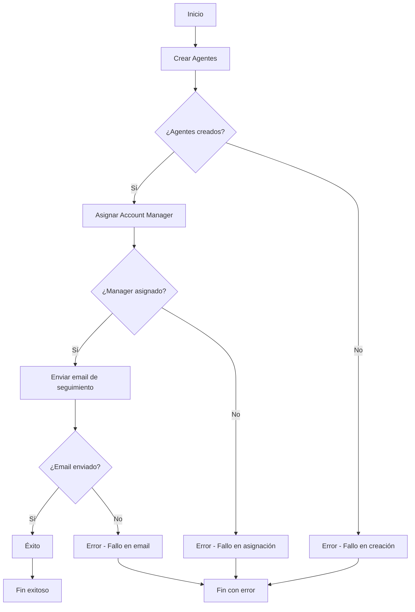

# Site Setup Workflow

Workflow automatizado para la configuración inicial de nuevos sitios en Uncodie.

## Descripción

El `siteSetupWorkflow` orquesta el proceso completo de configuración de un nuevo sitio, incluyendo:

1. **Creación de agentes** - Configura los agentes de IA necesarios para el sitio
2. **Asignación de account manager** - Asigna un gestor de cuenta dedicado
3. **Envío de correo de seguimiento** - Notifica al cliente sobre la configuración completada y próximos pasos

## Flujo de trabajo



## Activities

### createAgentsActivity
- **Endpoint**: `/api/sites/setup/agents`
- **Función**: Crea los agentes de IA necesarios para el sitio
- **Agentes por defecto**: customer_support, sales, general

### assignAccountManagerActivity  
- **Endpoint**: `/api/sites/setup/account-manager`
- **Función**: Asigna un account manager al sitio
- **Criterios**: Disponibilidad, experiencia, carga de trabajo

### sendSetupFollowUpEmailActivity
- **Endpoint**: `/api/emails/send`
- **Función**: Envía email de bienvenida con información de configuración
- **Incluye**: Lista de agentes, datos del account manager, próximos pasos

## Parámetros de entrada

```typescript
interface SiteSetupParams {
  site_id: string;
  user_id: string;
  company_name: string;
  contact_email: string;
  contact_name: string;
  package_type?: string;
  custom_requirements?: string[];
}
```

## Resultado

```typescript
interface SiteSetupResult {
  success: boolean;
  site_id: string;
  agents_created: {
    success: boolean;
    total_created: number;
    agents: Array<{
      agent_id: string;
      type: string;
      name: string;
      status: string;
    }>;
  };
  account_manager_assigned: {
    success: boolean;
    account_manager: {
      manager_id: string;
      name: string;
      email: string;
      phone?: string;
    };
    assignment_date: string;
  };
  follow_up_email_sent: {
    success: boolean;
    messageId: string;
    recipient: string;
    timestamp: string;
  };
  setup_completed_at: string;
  error?: string;
}
```

## Uso

### Desde código TypeScript
```typescript
import { getTemporalClient } from '../temporal/client';

const client = await getTemporalClient();

const result = await client.workflow.execute('siteSetupWorkflow', {
  args: [{
    site_id: 'site-123',
    user_id: 'user-456',
    company_name: 'TechCorp',
    contact_email: 'contact@techcorp.com',
    contact_name: 'John Doe',
    package_type: 'premium'
  }],
  taskQueue: 'site-setup-queue',
  workflowId: `site-setup-${Date.now()}`,
});
```

### Desde API REST
```bash
curl -X POST /api/workflows/execute \
  -H "Content-Type: application/json" \
  -d '{
    "workflowType": "siteSetupWorkflow",
    "params": {
      "site_id": "site-123",
      "user_id": "user-456",
      "company_name": "TechCorp",
      "contact_email": "contact@techcorp.com",
      "contact_name": "John Doe"
    }
  }'
```

## Testing

Ejecutar los tests del workflow:

```bash
# Test completo
npm run test:site-setup

# Test individual
npx ts-node src/scripts/test-site-setup-workflow.ts
```

## Configuración

### Task Queue
- **Queue**: `site-setup-queue`
- **Timeout**: 5 minutos por activity
- **Reintentos**: 3 intentos máximo

### Variables de entorno requeridas
- API endpoints configurados correctamente
- Credenciales de email service
- Base de datos de account managers

## Logs y monitoreo

El workflow genera logs detallados para cada paso:
- 🚀 Inicio del workflow
- 🤖 Creación de agentes
- 👤 Asignación de account manager  
- 📧 Envío de email de seguimiento
- ✅ Finalización exitosa / ❌ Error

## Manejo de errores

El workflow está diseñado para ser robusto:
- Si falla la creación de agentes, el workflow termina
- Si falla la asignación del account manager, el workflow termina
- Si falla el envío del email, se registra pero no se considera error crítico
- Todos los errores se capturan y reportan en el resultado final 