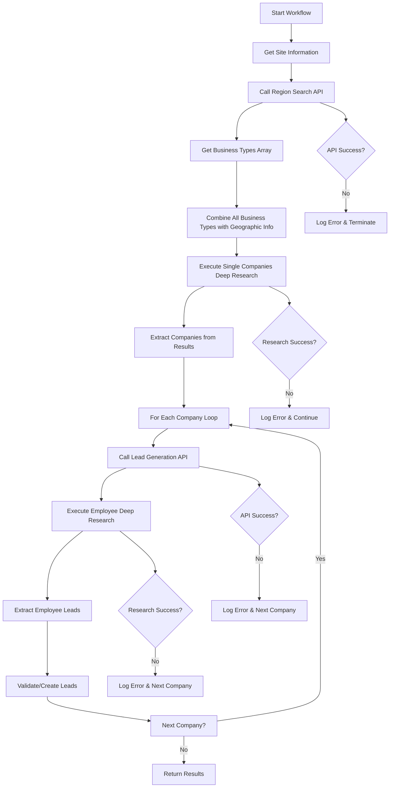

# Lead Generation Workflow

## Overview

The `leadGenerationWorkflow` is a comprehensive workflow designed to automatically generate qualified leads for a specific site using AI agents and deep research capabilities.

## Architecture

The workflow follows a 4-step process:

1. **Site Information Retrieval** - Gets site details
2. **Region Search API Call** - Calls `/api/agents/sales/regionSearch` → returns `business_types` array
3. **Unified Companies Deep Research** - Single deep research using ALL business types combined with geographic info
4. **Individual Company Processing** - For each company found:
   - 4a. Call `/api/agents/sales/leadGeneration` with company-specific parameters
   - 4b. Execute deep research focused on employees of that company
   - 4c. Extract and validate leads for that company

## Workflow Flow



## Input Options

```typescript
interface LeadGenerationOptions {
  site_id: string;                    // Required: Site ID
  userId?: string;                    // Optional: User ID
  create?: boolean;                   // Default false for validation only
  additionalData?: any;               // Optional: Additional data
}
```

## Output Result

```typescript
interface LeadGenerationResult {
  success: boolean;
  siteId: string;
  siteName?: string;
  siteUrl?: string;
  regionSearchResult?: any;          // Result from region search API
  businessTypes?: BusinessType[];    // Business types array from region search
  enhancedSearchTopic?: string;      // Combined search topic with geographic info
  targetCity?: string;               // Target city from region search
  targetRegion?: string;             // Target region from region search
  companiesResearchResult?: any;     // Result from unified companies deep research
  companiesFound?: CompanyData[];    // All companies found in single research
  companyResults?: Array<{           // Results per company
    company: CompanyData;
    leadGenerationResult?: any;
    employeeResearchResult?: any;
    leadsGenerated?: LeadData[];
    errors?: string[];
  }>;
  totalLeadsGenerated?: number;
  leadCreationResults?: any[];       // Results from lead creation/validation
  errors: string[];
  executionTime: string;
  completedAt: string;
}

interface BusinessType {
  name: string;                      // Name of the business type (from API)
  description: string;               // Description of the business type
  relevance: string;                 // Why this type is relevant for the region
  market_potential: string;          // Market potential assessment
}
```

## Data Structures

### Company Data Structure

The workflow first identifies companies with the following structure:

```typescript
interface CompanyData {
  name: string;                      // Required: Company name
  website?: string;                  // Optional: Website URL
  industry?: string;                 // Optional: Industry
  description?: string;              // Optional: Company description
  location?: string;                 // Optional: Location
  size?: string;                     // Optional: Company size
  employees_count?: number;          // Optional: Number of employees
  [key: string]: any;                // Additional company data
}
```

### Lead Data Structure

The workflow generates leads with the following structure:

```typescript
interface LeadData {
  name: string;                      // Required: Lead name
  telephone?: string;                // Optional: Phone number
  email: string;                     // Required: Email address
  company_name?: string;             // Optional: Company name
  address?: string;                  // Optional: Address
  web?: string;                      // Optional: Website URL
  position?: string;                 // Optional: Job position
}
```

## Usage Examples

### Basic Usage (Validation Mode)

```typescript
import { leadGenerationWorkflow } from '../temporal/workflows/leadGenerationWorkflow';

const result = await client.workflow.execute(leadGenerationWorkflow, {
  workflowId: 'lead-gen-site-123',
  taskQueue: 'workflows',
  args: [{
    site_id: 'site-123',
    create: false  // Validation only
  }]
});
```

### Production Usage (Creation Mode)

```typescript
const result = await client.workflow.execute(leadGenerationWorkflow, {
  workflowId: 'lead-gen-site-123',
  taskQueue: 'workflows',
  args: [{
    site_id: 'site-123',
    userId: 'user-456',
    create: true,  // Actually create leads
    additionalData: {
      priority: 'high',
      source: 'automated_generation'
    }
  }]
});
```

## Activities Used

### Core Activities
- `getSiteActivity` - Retrieves site information
- `logWorkflowExecutionActivity` - Logs workflow execution
- `saveCronStatusActivity` - Updates cron status

### Lead Generation Activities
- `callRegionSearchApiActivity` - Calls the region search API
- `callLeadGenerationApiActivity` - Calls the lead generation API (per company)
- `createLeadsFromResearchActivity` - Creates/validates leads from research

### Child Workflows
- `deepResearchWorkflow` - Executes deep research based on generated topic

## API Integration

The workflow integrates with the following API endpoints:

- **POST** `/api/agents/sales/regionSearch`
  - Input: `{ site_id, userId, ...additionalData }`
  - Output: `{ success, data: { business_types, target_city, target_region } }`

- **POST** `/api/agents/sales/leadGeneration` (called per company)
  - Input: `{ site_id, userId, company, ...additionalData }`
  - Output: `{ success, data: { search_topic, target_city, target_region }, prompt }`

## Configuration

### Timeouts
- Standard activities: 5 minutes
- Lead generation activities: 10 minutes
- Deep research workflow: Handled by child workflow

### Retry Policy
- Maximum attempts: 3
- Applies to all activities

## Error Handling

The workflow implements comprehensive error handling:

1. **Region Search API Failures** - Logged and workflow terminates as business types are required
2. **Companies Deep Research Failures** - Logged and workflow continues with available data
3. **Individual Company Processing Failures** - Logged per company, other companies continue processing
4. **Lead Generation API Failures** - Logged per company, employee research may still proceed
5. **Employee Deep Research Failures** - Logged per company, other companies continue processing
6. **Lead Validation Failures** - Individual leads are marked as invalid
7. **Database Errors** - Logged but don't stop the workflow in validation mode

## Validation vs Creation Mode

### Validation Mode (`create: false`)
- Default mode for testing and development
- Validates lead data structure and required fields
- Does not create records in the database
- Returns validation results for review

### Creation Mode (`create: true`)
- Production mode for actual lead generation
- Creates validated leads in the database
- Requires proper permissions and configuration
- Returns creation results with lead IDs

## Deliverables Structure

### New Unified Structure (Recommended)

The workflow now generates a **unified deliverables structure** that keeps lead and company information cohesive:

```typescript
{
  // Unified leads structure - each lead includes integrated company info
  leads: [
    {
      // Lead personal information
      name: string,
      telephone: string,
      email: string,
      position: string,
      address: string,
      
      // Company information integrated with each lead
      company: {
        name: string,
        website: string,
        industry: string,
        description: string,
        size: string,
        founded: string,
        address: string,
        phone: string,
        email: string,
        linkedin_url: string,
        employees_count: number,
        annual_revenue: string,
        business_model: string,
        products_services: string[],
        key_people: object[],
        social_media: object,
        _research_timestamp: string,
        _research_source: string
      }
    }
  ]
}
```

### Key Benefits

✅ **Research Cohesion**: Company information stays connected to each specific lead  
✅ **No Fragmentation**: Prevents research from being split between leads and companies  
✅ **Contextual Processing**: Agents can process each lead with full company context  
✅ **Better Results**: More accurate and relevant lead generation  
✅ **Simplified Structure**: Easier to understand and work with  

### Backwards Compatibility

The workflow maintains compatibility with existing structures:

```typescript
{
  // Legacy separate structures (maintained for compatibility)
  lead: {
    name: string,
    telephone: string,
    email: string,
    position: string,
    address: string,
    web: string
  },
  company: {
    name: string,
    website: string,
    industry: string,
    // ... other company fields
  }
}
```

### Migration Guide

**Before (Fragmented Structure)**:
```typescript
// Old structure - company info separated from leads
{
  lead: {
    leads: [{ name: "John", email: "john@example.com", company_name: "TechCorp" }]
  },
  company: {
    name: "TechCorp",  // Disconnected from specific lead
    website: "techcorp.com",
    industry: "Technology"
  }
}
```

**After (Unified Structure)**:
```typescript
// New structure - company info integrated with each lead
{
  leads: [
    {
      name: "John",
      email: "john@example.com",
      position: "CTO",
      company: {
        name: "TechCorp",      // Connected to this specific lead
        website: "techcorp.com",
        industry: "Technology",
        description: "Leading tech company...",
        size: "50-200 employees"
      }
    }
  ]
}
```

## Testing

Use the test script to validate the workflow:

```bash
# Run validation test
tsx src/scripts/test-lead-generation.ts

# With environment variables
TEST_SITE_ID=your-site-id TEST_USER_ID=your-user-id tsx src/scripts/test-lead-generation.ts
```

## Monitoring

The workflow provides detailed logging at each step:

- 🔥 Workflow start
- 🏢 Site information retrieval
- 📡 API call execution (with search topic and target city)
- 🔬 Deep research execution
- 👥 Lead extraction
- 📊 Lead validation/creation
- 🎉 Workflow completion

## Performance Considerations

- Deep research workflow can take several minutes
- Lead generation API response time varies
- Database operations are batched for efficiency
- Validation mode is significantly faster than creation mode

## Security Notes

- Lead data is validated before database insertion
- Email addresses are validated for proper format
- URLs are validated for proper structure
- Sensitive data is not logged in production

## Future Enhancements

1. **Lead Scoring** - Add lead quality scoring
2. **Duplicate Detection** - Prevent duplicate lead creation
3. **Enrichment Integration** - Integration with external data sources
4. **Batch Processing** - Support for multiple sites
5. **Scheduling** - Automated periodic execution 